<div align="center">
  <div style="display: flex; justify-content: center; align-items: center; gap: 10px;">
    
    
  </div>
</div>


<h3 align="center">Show your skills with badges or custom your own one!</h3>
<hr>

## DEPLOYMENT LINK! => [Stemma](https://stemma.vercel.app/)
#### Backend code? => [Stemma Backend](https://github.com/insooeric/GithubBadges-Backend)
# Docs

- [Example](#example)
- [Specifying Badges](#specifying-badges)
- [Use personal Badges](#use-personal-badges)
- [Centering Badges](#centering-badges)
- [Badges List](#badges-list)

# Example

<p align="center">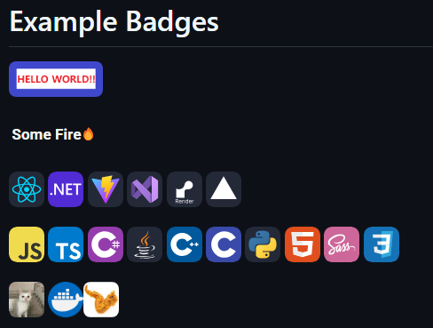</p>

# Specifying Badges

Copy and paste the code block below into your readme to add the skills badge element!

Change the `?badge=acrobat` to a name of badge you want to use. You can find a full list of badges [here](#badges-list).

```md

```


# Use personal Badges

You can configure personal badges then use it. Note that others can use your badge; However, they can't modify the badge.

[Badge Hub Website](https://badgehub.vercel.app/) allows you to create/modify/delete your personal badges.

The value of `user` and `badge` are string; `user` is github user name and `badge` is a name of badge you assigned.

```md

```


# Centering Badges

Want to center the badges in your readme? The SVGs are automatically resized, so you can do it the same way you'd normally center an image.

```html
<p align="center">
  
</p>
```

<p align="center">
  
</p>

# Badges List

|      Badge ID       |                         Badge                         |      Badge ID      |                        Badge                         |      Badge ID       |                         Badge                         |
| :-----------------: | :---------------------------------------------------: | :----------------: | :--------------------------------------------------: | :-----------------: | :---------------------------------------------------: |
|      `acrobat`      |            |   `githubpages`    |       |       `popos`       |              |
|    `activitypub`    |        |    `gitkraken`     |    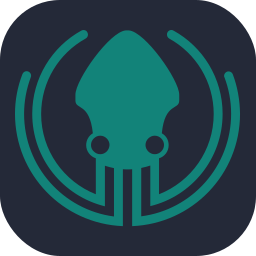     |     `portfolio`     |          |
|       `actix`       |       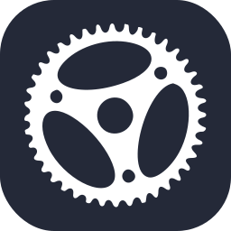       |      `gitlab`      |            |    `postgresql`     |         |
|    `adobespark`     |    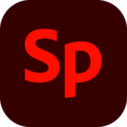     |      `gleam`       |             |      `postman`      |            |
|      `adonis`       |             |      `gmail`       |             |    `powerpoint`     |         |
|       `aero`        |       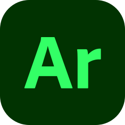        |      `gnome`       |             |    `powershell`     |         |
|   `aftereffects`    |       |      `godot`       |      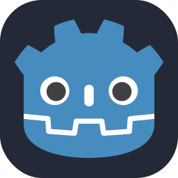       |      `preact`       |             |
|     `aiscript`      |           |      `goland`      |            |      `prelude`      |      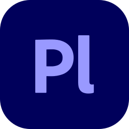      |
|     `alacritty`     |     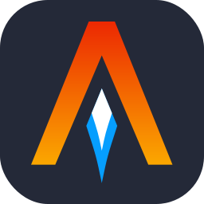     |      `golang`      |            |     `premiere`      |           |
|      `alchemy`      |      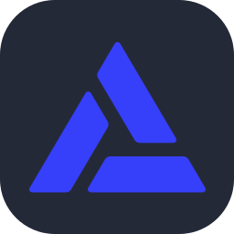      | `googleanalytics`  |   |   `premiererush`    |   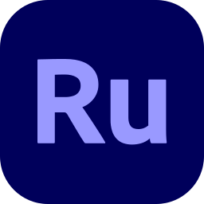    |
|     `alpinejs`      |     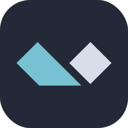      | `googleappsscript` |  |     `primevue`      |     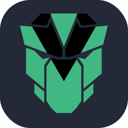      |
|     `anaconda`      |           |      `gradle`      |            |      `prisma`       |             |
|      `android`      |            |     `grafana`      |           |    `processing`     |         |
|   `androidstudio`   |   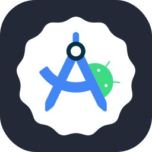   |      `grails`      |            |    `prometheus`     |         |
|      `angular`      |      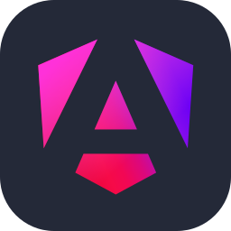      |     `graphql`      |     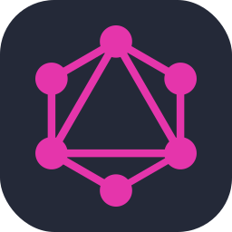      |      `prompts`      |      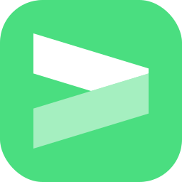      |
|      `animate`      |      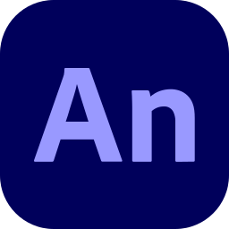      |     `gromacs`      |           |      `proton`       |             |
|      `ansible`      |      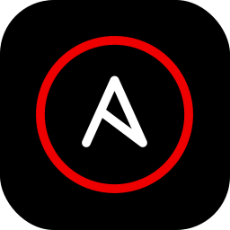      |       `grpc`       |       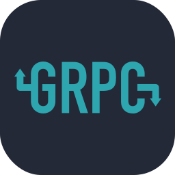       |      `proxmox`      |            |
|       `anss`        |               |      `grunt`       |             |        `pug`        |                |
|        `api`        |        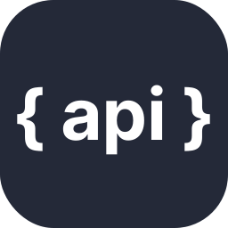        |       `gsap`       |              |       `pulse`       |              |
|      `apidog`       |      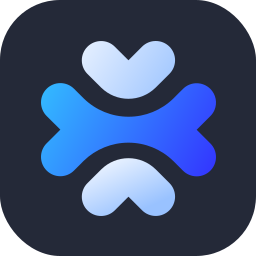       |       `gtk`        |       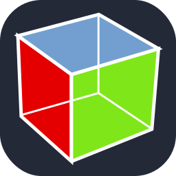        |     `puppeteer`     |     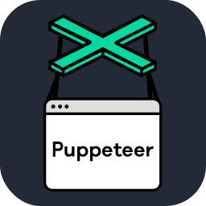     |
|      `apollo`       |             |       `gulp`       |              |      `pycharm`      |            |
|      `appcode`      |      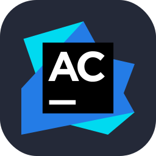      |      `hadoop`      |            |      `pygame`       |             |
|       `apple`       |       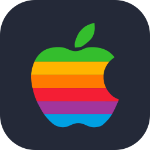       |     `hardhat`      |           |      `python`       |             |
|     `apptainer`     |     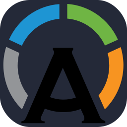     |     `haskell`      |     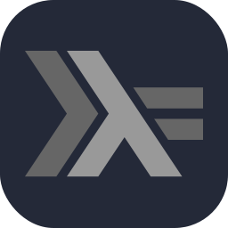      |      `pytorch`      |            |
|     `appwrite`      |           |       `haxe`       |              |       `pyxel`       |       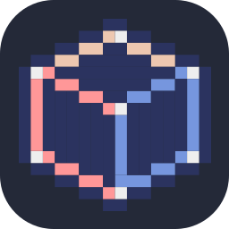       |
|       `aqua`        |       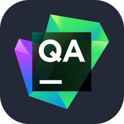        |    `haxeflixel`    |    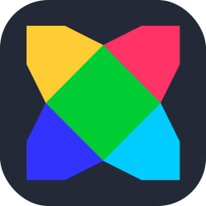    |      `qdrant`       |      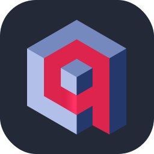       |
|    `arcbrowser`     |    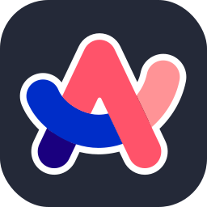     |      `helix`       |             |      `qodana`       |             |
|       `arch`        |               |       `helm`       |              |        `qt`         |                 |
|      `arcjet`       |      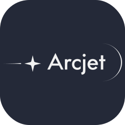       |       `herd`       |              |      `quarkus`      |      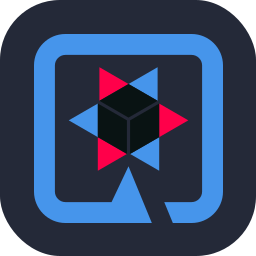      |
|      `arduino`      |            |      `heroku`      |            |         `r`         |                  |
|      `argocd`       |             |    `hibernate`     |         |     `rabbitmq`      |           |
|     `assembly`      |           |      `holyc`       |      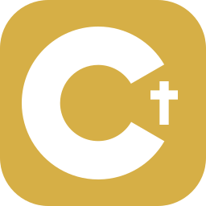       |       `rails`       |              |
|       `astro`       |              |       `hono`       |              |      `railway`      |            |
|       `atom`        |               |     `horizon`      |           |    `raspberrypi`    |        |
|     `audition`      |           |       `html`       |              |       `react`       |              |
|      `authjs`       |             |       `htmx`       |              |  `reactbootstrap`   |  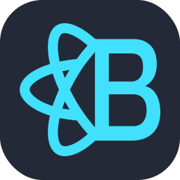   |
|      `autocad`      |      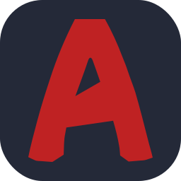      |       `htop`       |              |     `reactivex`     |     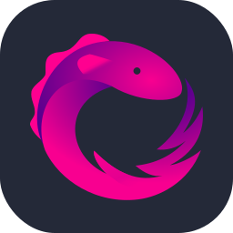     |
|    `avaloniaui`     |         |   `huggingface`    |       |    `reactnative`    |        |
|        `aws`        |                |       `hugo`       |              |      `reactos`      |      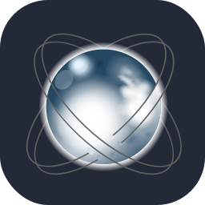      |
|       `azul`        |               |     `hydrogen`     |          |    `reactquery`     |         |
|       `azure`       |       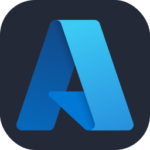       |     `hyprland`     |     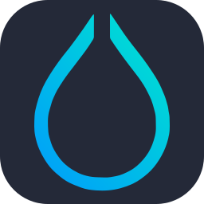     |      `recoil`       |      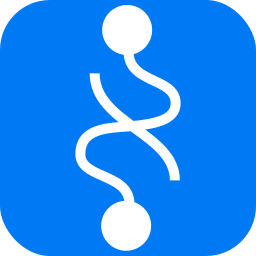       |
|    `azuredevops`    |        |        `i3`        |        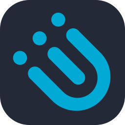        |      `redhat`       |             |
|       `babel`       |              |       `iced`       |       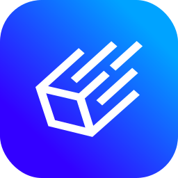       |       `redis`       |              |
|      `barbajs`      |            |       `idea`       |              |     `redshift`      |     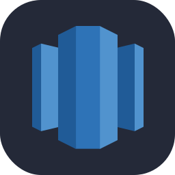      |
|       `bash`        |               |      `ignite`      |            |       `redux`       |              |
|     `beeceptor`     |          |   `illustrator`    |       |       `regex`       |       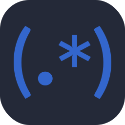       |
|      `behance`      |            |      `incopy`      |            |       `remix`       |              |
|       `behat`       |              |     `indesign`     |          |      `render`       |      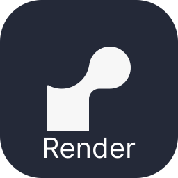       |
|       `bevy`        |       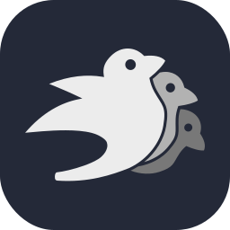        |     `inertia`      |           |       `renpy`       |              |
|     `bigquery`      |           |      `infura`      |      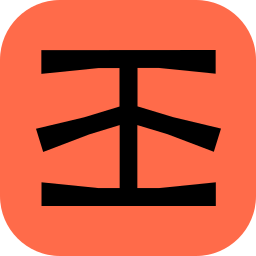      |      `replit`       |             |
|     `bitbucket`     |     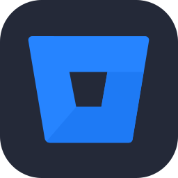     |     `inkscape`     |          |     `resharper`     |          |
|      `blazor`       |             |     `insomnia`     |          |      `reverb`       |             |
|      `blender`      |            |    `instagram`     |         |      `revolt`       |             |
|      `bluesky`      |            |   `integrations`   |      |       `rider`       |              |
|       `bokeh`       |              |       `ipfs`       |              |   `robloxstudio`    |       |
|     `bootstrap`     |          |      `jamovi`      |            |      `rocket`       |             |
|       `brave`       |              |       `java`       |              |     `rollupjs`      |           |
|      `breeze`       |             |    `javascript`    |        |        `ros`        |                |
|      `bridge`       |             |       `jax`        |               |      `rubocop`      |            |
|        `bsd`        |                |      `jekyll`      |            |       `ruby`        |               |
|       `btlo`        |               |     `jenkins`      |           |     `rubymine`      |           |
|       `bulma`       |              |       `jest`       |              |       `rust`        |               |
|        `bun`        |                |  `jetpackcompose`  |    |     `rustrover`     |          |
|         `c`         |                  |    `jetstream`     |         |        `s3`         |                 |
|      `cachyos`      |            |       `jira`       |              |      `safari`       |             |
|       `caddy`       |              |      `joomla`      |            |       `sail`        |               |
|       `cairo`       |              |      `jquery`      |            |      `sanctum`      |            |
|       `canva`       |              |      `julia`       |             |        `sas`        |                |
|     `capacitor`     |          |     `jupyter`      |           |       `sass`        |               |
|      `capture`      |            |      `kafka`       |             |       `scala`       |              |
|      `cashier`      |            |      `kaggle`      |            |    `scikitlearn`    |        |
|     `cassandra`     |          |     `kakoune`      |           |       `scipy`       |              |
|     `chainlink`     |          |       `kali`       |              |       `scout`       |              |
| `characteranimator` |  |      `karma`       |             |      `scratch`      |            |
|      `chartjs`      |            |       `kde`        |               |      `seaborn`      |            |
|      `chatgpt`      |            |     `keycloak`     |          |     `selenium`      |           |
|      `chrome`       |             |      `keydb`       |             |      `sentry`       |             |
|     `chromium`      |           |      `kibana`      |            |     `sequelize`     |          |
|     `circleci`      |           |      `kitty`       |             |    `sharepoint`     |         |
|      `claude`       |             |      `kotlin`      |            |      `shopify`      |            |
|       `clerk`       |              |       `ktor`       |              |      `signal`       |             |
|       `clion`       |              |    `kubernetes`    |        |    `skeletonui`     |         |
|      `clojure`      |            |    `langchain`     |         |     `sketchup`      |           |
|    `cloudflare`     |         |     `laravel`      |           |       `slack`       |              |
|       `cmake`       |              |   `laravelspark`   |      |     `snowflake`     |          |
|    `cockroachdb`    |        |      `latex`       |             |       `snyk`        |               |
|     `codeberg`      |           |     `lazyvim`      |           |     `socialite`     |          |
|    `codeigniter`    |        |     `leaflet`      |           |     `socketio`      |           |
|      `codepen`      |            |     `leetcode`     |          |      `solana`       |             |
|   `coffeescript`    |       |       `less`       |              |     `solidity`      |           |
|   `commercetools`   |      |      `libsql`      |            |      `solidjs`      |            |
|     `composer`      |           |     `linkedin`     |          |     `sonarqube`     |          |
|    `contentful`     |         |      `linux`       |             |       `spark`       |              |
|        `cpp`        |                |       `lit`        |               |      `spring`       |             |
|   `creativecloud`   |      |      `litmus`      |            |    `sqlalchemy`     |         |
|      `crystal`      |            |     `livewire`     |          |      `sqlite`       |             |
|        `cs`         |                 |    `llamaindex`    |        |     `sqlserver`     |          |
|        `css`        |                |      `logto`       |             |   `stackoverflow`   |      |
|       `cuda`        |               |      `looker`      |            |       `steam`       |              |
|      `cypress`      |            |       `lua`        |               |       `stock`       |              |
|         `d`         |                  |       `luau`       |              |     `storyblok`     |          |
|        `d3`         |                 |    `lucidchart`    |        |     `storybook`     |          |
|     `dailydev`      |           |      `lunacy`      |            |      `strapi`       |             |
|      `daisyui`      |            |       `lxc`        |               |     `streamlit`     |          |
|       `dart`        |               |     `manjaro`      |           |      `stripe`       |             |
|    `databricks`     |         |     `mariadb`      |           | `styledcomponents`  |   |
|      `datadog`      |            |     `markdown`     |          |      `stylus`       |             |
|     `datagrip`      |           |     `mastodon`     |          |      `sublime`      |            |
|     `dataspell`     |          |    `materialui`    |        |     `supabase`      |           |
|      `davinci`      |            |      `matlab`      |            |     `surrealdb`     |          |
|      `dbeaver`      |            |    `matplotlib`    |        |      `svelte`       |             |
|      `debian`       |             |      `maven`       |             |        `svg`        |                |
|      `defold`       |             |   `mediaencoder`   |      |        `svn`        |                |
|       `deno`        |               |     `mermaid`      |           |      `swagger`      |            |
|      `desmos`       |             |     `metabase`     |          |       `swift`       |              |
|       `devto`       |              |     `meteorjs`     |          |      `symfony`      |            |
|   `digitalocean`    |       | `microsoftcopilot` |  |      `tableau`      |            |
|     `dimension`     |          |    `millionjs`     |         |    `tailwindcss`    |        |
|     `directus`      |           |      `milvus`      |            |    `tallyprime`     |         |
|      `discord`      |            |     `mindsdb`      |           |       `tauri`       |              |
|    `discordbots`    |        |       `mint`       |              |       `teams`       |              |
|     `discordjs`     |          |       `miro`       |              |     `telegram`      |           |
|      `django`       |             |     `misskey`      |           |     `telescope`     |          |
|      `docker`       |             |     `mistral`      |           |    `tensorflow`     |         |
|      `docksal`      |            |       `mjml`       |              |     `terminal`      |           |
|      `docsify`      |            |       `ml5`        |               |     `terraform`     |          |
|      `dotnet`       |             |      `mocha`       |             |  `testinglibrary`   |     |
|    `dreamweaver`    |        |       `mojo`       |              |      `threejs`      |            |
|      `drizzle`      |            |     `mongodb`      |           |    `thunderbird`    |        |
|      `drupal`       |             |     `mongoose`     |          |     `thunkable`     |          |
|    `duckduckgo`     |         |      `mysql`       |             |       `tidb`        |               |
|       `dusk`        |               |      `neovim`      |            |       `tmux`        |               |
|     `dynamodb`      |           |      `nestjs`      |            |      `tomcat`       |             |
|       `echo`        |               |     `netlify`      |           |        `tor`        |                |
|      `eclipse`      |            |      `nextjs`      |            |       `trpc`        |               |
|       `edge`        |               |      `nginx`       |             |      `truffle`      |            |
|   `elasticsearch`   |      |      `ngrok`       |             |       `twig`        |               |
|     `electron`      |           |       `nim`        |               |      `twitch`       |             |
|    `elementplus`    |        |      `nixos`       |             |      `typeorm`      |            |
|      `elixir`       |             |      `nodejs`      |            |    `typescript`     |         |
|        `elm`        |                |    `notepadpp`     |         |      `ubuntu`       |             |
|      `elysia`       |             |      `notion`      |            |       `unity`       |              |
|       `emacs`       |              |       `nova`       |              |   `unitycatalog`    |       |
|       `ember`       |              |       `npm`        |               |      `unocss`       |             |
|      `emotion`      |            |      `numpy`       |             |   `unrealengine`    |       |
|      `envoyer`      |            |      `nuxtjs`      |            |         `v`         |                  |
|      `erlang`       |             |     `obsidian`     |          |      `vagrant`      |            |
|       `etcd`        |               |      `ocaml`       |             |       `vala`        |               |
|       `excel`       |              |      `octane`      |            |       `vapor`       |              |
|       `expo`        |               |      `octave`      |            |      `vercel`       |             |
|     `expressjs`     |          |       `odin`       |              |        `vim`        |                |
|      `fabric`       |             |      `ollama`      |            |    `virtualbox`     |         |
|     `facebook`      |           |     `onedrive`     |          |    `visualbasic`    |        |
|      `fastai`       |             |     `onenote`      |           |   `visualstudio`    |       |
|      `fastapi`      |            |      `opencv`      |            |       `vite`        |               |
|     `fastlane`      |           |      `openmm`      |            |      `vitest`       |             |
|     `fediverse`     |          |    `openshift`     |         | `vmwareworkstation` |  |
|      `ffmpeg`       |             |    `opensource`    |        |      `vscode`       |             |
|       `fiber`       |              |    `openstack`     |         |     `vscodium`      |           |
|       `figma`       |              |   `openzeppelin`   |      |       `vuejs`       |              |
|     `filament`      |           |      `opera`       |             |      `vuetify`      |            |
|     `firebase`      |           |      `oracle`      |            |       `vyper`       |              |
|      `firefox`      |            |      `orchid`      |            |       `wails`       |              |
|     `flameshot`     |          |     `outlook`      |           |       `wandb`       |              |
|       `flask`       |              |       `p5js`       |              |       `warp`        |               |
|       `fleet`       |              |       `pail`       |              |    `webassembly`    |        |
|      `flutter`      |            |      `pandas`      |            |      `webflow`      |            |
|    `flutterflow`    |        |    `papertrail`    |        |      `webpack`      |            |
|       `flyio`       |              |     `payload`      |           |     `webstorm`      |           |
|       `fonts`       |              |       `pbi`        |               |      `wezterm`      |            |
|       `forge`       |              |     `pennant`      |           |     `windicss`      |           |
|      `forgejo`      |            |       `perl`       |              |      `windows`      |            |
|       `forth`       |              |    `photoshop`     |         |     `wireshark`     |          |
|      `fortran`      |            | `photoshopclassic` |  |       `word`        |               |
|    `frankenphp`     |         | `photoshopexpress` |  |     `wordpress`     |          |
|      `fresco`       |             |       `php`        |               |      `workers`      |            |
|       `fresh`       |              |     `phpstan`      |           |        `wsl`        |                |
|       `fuse`        |               |     `phpstorm`     |          |         `x`         |                  |
|  `gamemakerstudio`  |    |     `picocss`      |           |       `xcode`       |              |
|      `ganache`      |            |     `pinecone`     |          |        `xd`         |                 |
|      `gatsby`       |             |    `pinescript`    |        |       `yaml`        |               |
|        `gcp`        |                |      `pinia`       |             |      `yammer`       |             |
|     `gdevelop`      |           |       `pint`       |              |       `yarn`        |               |
|      `gemini`       |             |       `pkl`        |               |        `yew`        |                |
|      `gentoo`       |             |      `plan9`       |             |        `yii`        |                |
|      `gherkin`      |            |   `planetscale`    |       |      `youtube`      |            |
|       `gimp`        |               |    `platformio`    |        |      `zabbix`       |             |
|        `gin`        |                |    `playwright`    |        |        `zed`        |                |
|        `git`        |                |      `plsql`       |             |      `zellij`       |             |
|       `gitea`       |              |       `pm2`        |               |        `zen`        |                |
|      `github`       |             |       `pnpm`       |              |        `zig`        |                |
|   `githubactions`   |      |    `pocketbase`    |        |      `zudoku`       |             |
|   `githubcopilot`   |      |      `podman`      |            |      `zustand`      |            |
